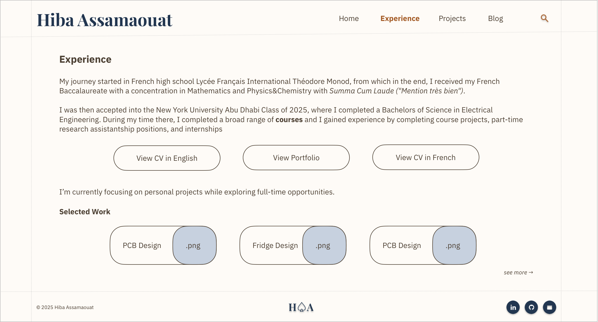
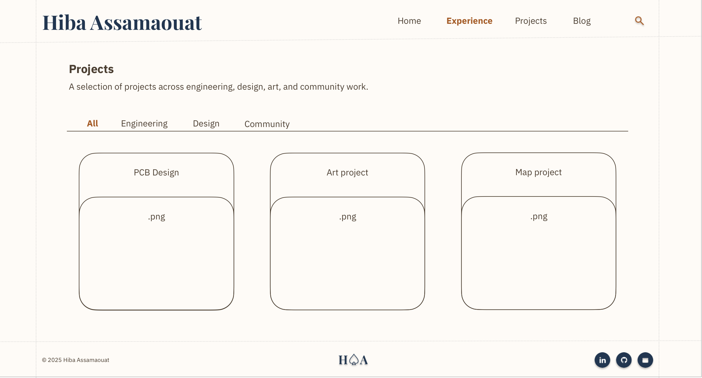

# Hiba Assamaouat
Personal website of Hiba Assamaouat  

:warning: Work in Progress :construction:

## Tasks & Timeline

This is the first phase of this website. Twice before, I have tried to develop it, but have failed to complete it because I was building up on a fragile base, and more ideas kept emerging, which caused me to stack blocks on a tower that was bound to fall. This repository is a new version, rebuilt from scratch. 
I would like to specify that no template was used here. I code everything up myself, along with some help from the internet of course and by getting inspired by the websites made by some peers. I have nothing against using templates, I simply made the choice to take this project as a web dev challenge. 

---
`14-12-2025`  
  - [X] New repository set up  
  - [X] Set the deadlines for MVP  
---
`15-12-2025`  
  - [X] Reevaluate the importance of each page and what should be kept  
  - [x] Redefine the look and feel of the page (probably not switching to a one-pager, I want the freedom to add new tabs)  
  - [x] Set up styles.css  

Initial tabs are: `Home`, `Experience`, `Projects`, `Coursework`, and `Blog`.  
Updated configuration and contents: 

  >`Home` Brief introduction of who I am and what I currently do. This page should be enough for a recruiter (or anyone) to learn everything about me. CV should be accessible from here, as well as my social pages. The rest of the tabs serve as an experience for the visitor and allows them to dive deeper into my story.

  >`Experience` Here the visitor gets a story of my career, they can access my cv, my portfolio, they can read my journey to and through NYUAD (`Coursework` tab gets integrated here), then my internship and research experiences, and finally, they can find out what I am currently up to.

  >`Projects` This one compiles all the academic and non academic projects, engineering, design, art projects. Portfolio will also be accessible through here. In each project, I need to explain the tools used, my contributions, lessons learnt.

  >`Blog` For the time being, this page will be kept as a "coming soon".

The look and feel of the page are first visualized on a design app. Could be Figma, Powerpoint, Keynote, etc. I use Freeform. Using my initial design along with my peers' personal websites, I put together and edit the first using the fonts and palette until I reach the configuration I am satisfied with. My goal is to keep things minimal and, as described in the `Home` tab description, to make it able to stand alone, with all the necessary information for a recruiter without needing to search for the fundamental things about me elsewhere.
It should look something like the following:

  

The palette was not changed from the previous version of the website:

  

The idea is to keep things simple. Any pizzazz or fancy fonts can be dedicated in the art and design projects.

Let's get coding!

---
`21-12-2025`  
  - [x] Navigation bar & footer
  - [x] started favicon design and config
  - [x] started the navigation bar responsive to window size (sidebar)

---
`22-12-2025`  
  - [x] (12-1am) finished the navigation bar responsive to window size (sidebar)
  - [x] (1pm) few touch-ups on the navigation sidebar
  - [x] (5pm) fill main content of landing page

---
`23-12-2025`  
  - [x] (12am) landing page completed
  - [x] Experience page design/look and feel

The `Experience` page should look something like this, also brief and a short read, it will also invite the visitor to check out some highlited projects.
  

I also made the `Projects` page look and feel. I want it to be in the form of a filtered gallery where the visitor can go through the `Engineering` projects' tab, the `Design`, `Art`, and `Community` Projects. This is a more dynamic type of page, so it will most likely take the longest to code up!
  

But it's okay, in the meantime, the engineering projects are compiled in a pdf Portfolio available in the `Experience` Page.

`Blog` and the searchbar should not take long to make, plus they are on a low priority at the moment.

Now, before starting the codes for the rest of the pages, I need to decide whether I will be creating individual CSS files for each one. And the answer is yes. If along the way, I need to configure an element that will turn out to be useful across all the pages, then I will simply place it in the main styles.css file.

---
`24-12-2025`  
  - [x] (12am) Code the `Experience` page (almost finished)
  - [x] (9pm) `Experience` page complete
  - [x] (10pm) begin `Projects` page

---
`30-12-25`  
  - [x] add screen compatibility issue message

The `Projects` page is likely going to take longer to complete. Let's clear up the filtered gallery into smaller tasks:
  - [x] gallery main container
  - [x] horizontal filter tab list container
  - [ ] gallery subcontainer
  - [ ] gallery cards (add data-tags to the bottom of the cards)
  - [ ] javascript
  - [ ] ux fixes (transition)
  - [ ] start designing each project's page

---
`02-01-26`  
  - [ ] gallery subcontainer
  - [ ] gallery cards (add data-tags to the bottom of the cards)
  - [ ] javascript
  - [ ] ux fixes (transition)
  - [ ] start designing each project's page
  - [ ]
---
`25-01-26`  
  - [ ] deploy the github page, even if unfinished
  - [ ] ask for feedback on current page
  - [ ] fix favicon display
  - [ ] 404 not found page
  - [ ] UX Testing
  - [ ] last @media checks and updates
  - [ ] MVP complete
  - [ ] Begin editing the Linkedin post
---
`29-01-26`  
  - [ ] Change of plans, no Linkedin article posted, no big attention drawn to that is desired for this web dev project

## About the management of this repository

I am the sole author of this public repository and claim all this work to be mine. I invite any new coder to use my code as a reference but to implement their own, I tried to make it as clear and simple as possible for all.

I format the commits as such `daydatemonthhourminute`, to keep track of all the changes on GitHub and GitHub Desktop. For example the next commit I am doing will be: `mon15dec1354`.

## Useful How To's
Some cool tutortials of css and js features I might need in the future!
  - [https://www.w3schools.com/howto/howto_js_popup.asp](W3Schools-Popups)
  - [https://www.w3schools.com/howto/howto_css_signup_form.asp](W3Schools-SignUpForms) 
  - [https://www.w3schools.com/howto/howto_js_countdown.asp](W3Schools-CountdownTimer)
  - [https://www.w3schools.com/howto/howto_js_filter_elements.asp](W3Schools-FilterElements)
  - [https://www.w3schools.com/howto/howto_js_scroll_to_top.asp](W3Schools-ScrollAppears)
  - [https://www.w3schools.com/howto/howto_js_portfolio_filter.asp](W3Schools-PortfolioGallery)
  - [https://www.w3schools.com/howto/howto_css_animated_search.asp](W3Schools-AnimatedSearchForm)
  - [https://www.w3schools.com/howto/howto_css_overlay.asp](W3Schools-PageOverlayEffect)
  - [https://www.w3schools.com/howto/howto_js_autocomplete.asp](W3Schools-Autocomplete)
  - [https://www.w3schools.com/howto/howto_css_cards.asp](W3Schools-Cards)
  - [https://www.w3schools.com/howto/howto_js_todolist.asp](W3Schools-ToDoList)
  - [https://www.w3schools.com/howto/howto_css_breadcrumbs.asp](W3Schools-Breadcrumbs(Directory))
  - [https://www.w3schools.com/howto/howto_css_image_sticky.asp](W3Schools-StickyImage(GoodforBlog))
  - [https://www.w3schools.com/howto/howto_css_responsive_text.asp](W3Schools-ResponsiveTextSize(IMPORTANT)) <-- NEED
  - [https://www.w3schools.com/howto/howto_js_read_more.asp](W3Schools-ReadMoreReadLess)
  - [https://www.w3schools.com/howto/howto_js_sidenav.asp](W3Schools-SideNavigation)
  - [https://www.w3schools.com/howto/howto_css_modals.asp](W3Schools-ModalBox) <-- NEED
  - 
  - 
  - 
  - 
  - 
  - 
  - 